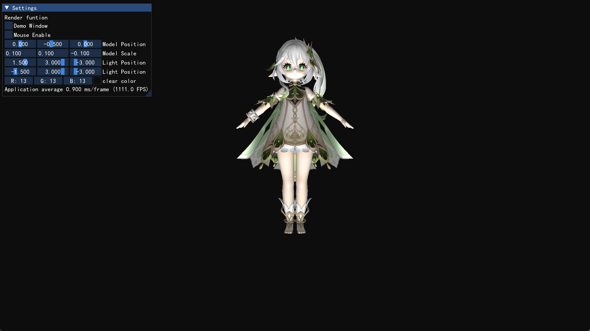

# ModelViewer

A ModelViewer built based on LearnOpengl's guide, using C++, opengl and imgui.

## Features

You can get a Blinn-Phong Model Rendering for your 3d model to view it.

**Camera:**

- WASD for close-far and left-right movement
- Mouse drag for rotation
- Mouse scroll for zoom
- pause for ignoring the input of camera

**Rendering:**

- Constant ambient light
- Blinn-Phong with one DirLight and two PointLights

**Model:**

You can import any format supported by assimp

An example model of  Nashida(Genshin Impact) is already in `opengl` directory. You can customize it.

## References

- LearnOpenGL CN, <https://learnopengl-cn.github.io/>
- Glad, Multi-Language GL/GLES/EGL/GLX/WGL Loader-Generator based on the official specs, <https://glad.dav1d.de/>
- GLFW, an Open Source, multi-platform library for OpenGL, OpenGL ES and Vulkan development on the desktop, <https://www.glfw.org/>
- GLM, a header only C++ mathematics library for graphics software based on the OpenGL Shading Language (GLSL) specifications, <https://github.com/g-truc/glm>
- The Asset Importer Library, <http://assimp.org/>
- stb, single-file public domain (or MIT licensed) libraries for C/C++, <https://github.com/nothings/stb>
- Dear ImGui, <https://github.com/ocornut/imgui>
- 【原神】纳西妲 , <https://www.aplaybox.com/details/model/3XMecJvZbStp>
